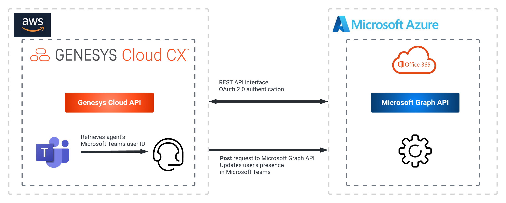

# (DRAFT) Update the presence of a Microsoft Teams user based upon a Genesys Cloud user presence update

This Genesys Cloud Developer Blueprint explains how to set up Genesys Cloud and Microsoft Azure Active Directory to update a Genesys Cloud user's presence in Microsoft Teams when a user presence change occurs in Genesys Cloud.

When an Architect workflow receives an inbound user presence change, a Microsoft Graph API call is sent to the Microsoft Teams user that is associated with the Genesys Cloud user. The Microsoft Teams user's presence is set to the MS Teams presence value that corresponds to the GC User presence value sent to the Architect workflow.

The following shows the end-to-end agent experience that this solution enables.

To trigger Microsoft Teams presence updates from Genesys Cloud, you use several public APIs that are available from Genesys Cloud and Microsoft Graph. The following illustration shows the API calls between Genesys Cloud and Microsoft 365.

