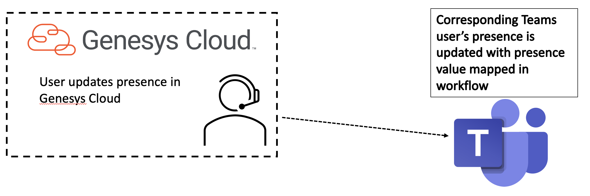

# Update the presence of a Microsoft Teams user based upon an inbound interaction

This Genesys Cloud Developer Blueprint describes how to setup Genesys Cloud and Microsoft Azure Active Directory. When a Genesys Cloud user's presence is updated, so is a Genesys Cloud agent's presence in Microsoft Teams.

View the full [update-ms-teams-user-presence-blueprint](https://github.com/GenesysCloudBlueprints/update-ms-teams-user-presence-blueprint "Goes to the update-ms-teams-user-presence-blueprint") in GitHub.