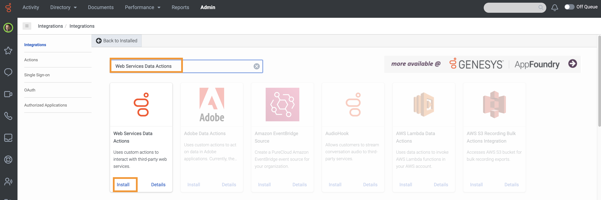
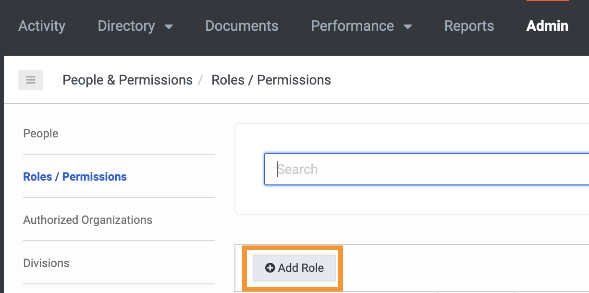
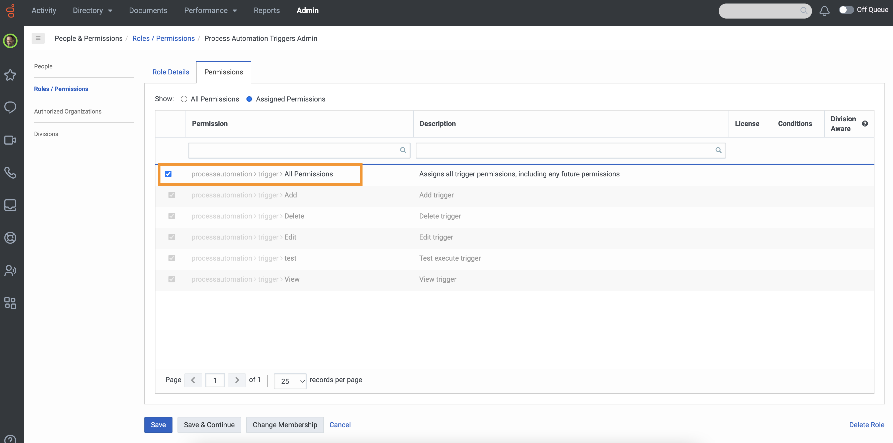
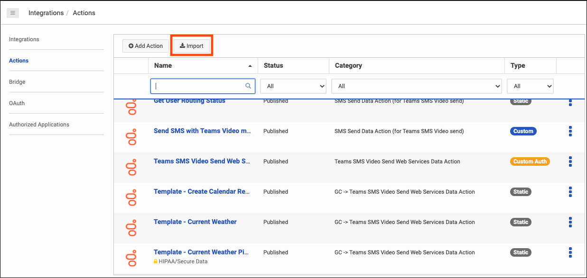
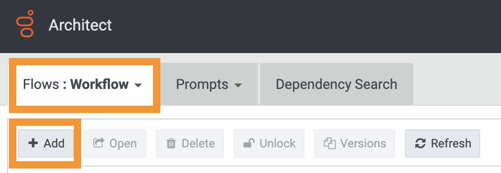

:::{"alert":"primary","title":"About Genesys Cloud Blueprints","autoCollapse":false} 
Genesys Cloud blueprints were built to help you jump-start building an application or integrating with a third-party partner. 
Blueprints are meant to outline how to build and deploy your solutions, not a production-ready turn-key solution.
 
For more details on Genesys Cloud blueprint support and practices 
see our Genesys Cloud blueprint [FAQ](https://developer.genesys.cloud/blueprints/faq "Opens the Blueprint FAQ") sheet.
:::

This Genesys Cloud Developer Blueprint describes how to set up Genesys Cloud and Microsoft Azure Active Directory. When a Genesys Cloud user's presence is updated, so is a Genesys Cloud agent's presence in Microsoft Teams.

The Microsoft Graph API call is sent when an Architect workflow receives an inbound user presence change from a Microsoft Teams user associated with the Genesys Cloud agent. The Microsoft Teams user's presence is set to the MS Teams presence value that corresponds to the GC User presence value sent to the Architect workflow.

The Genesys Cloud user’s perspective is shown in the following illustration.

The following shows the end-to-end agent experience provided by this solution.

Genesys Cloud and Microsoft Graph offer public APIs to trigger Microsoft Teams presence updates. In the following illustration, API calls are shown between Genesys Cloud and Microsoft 365.

## Solution components

* **Genesys Cloud** - A suite of Genesys cloud services for enterprise-grade communications, collaboration, and contact center management. Contact center agents use the Genesys Cloud user interface.
* **Genesys Cloud API** - A set of RESTful APIs that enable you to extend and customize your Genesys Cloud environment.
* **Microsoft Teams** - A meeting and communication app. Microsoft Teams is the app that hosts the meetings for this solution.
* **Microsoft Graph** - A unified API endpoint that enables developers to integrate services and devices with Microsoft products. This solution uses the API endpoint to update a user's presence in Microsoft Teams.
* **Microsoft Azure** - A cloud computing platform that provides a variety of cloud services for building, testing, deploying, and managing applications in Microsoft-managed data centers. Microsoft Azure hosts Microsoft 365.
* **Postman** - A platform for creating and sharing APIs.

## Prerequisites

### Specialized knowledge

* Administrator-level knowledge of Genesys Cloud
* Administrator-level knowledge of Microsoft Azure Active Directory
* Experience with REST API authentication
* Experience with Postman

### Genesys Cloud account

* A Genesys Cloud 2 license. For more information, see [Genesys Cloud Pricing](https://www.genesys.com/pricing "Opens the pricing article").
* The Master Admin role in Genesys Cloud. For more information, see [Roles and permissions overview](https://help.mypurecloud.com/?p=24360 "Opens the Roles and permissions overview article") in the Genesys Cloud Resource Center.
* The Microsoft Azure Active Directory SCIM integration for Microsoft Teams must be implemented in your Genesys Cloud organization. For more information, see [Configure the Microsoft Teams integration](https://help.mypurecloud.com/?p=222880 "Opens the Configure the Microsoft Teams integration article") in the Genesys Cloud Resource Center.

### Microsoft account

* The Azure Enterprise Agreement (Azure EA) requires a Microsoft account. Individual Azure accounts do not support the OAuth client with the client credentials grant type required for this solution.
* Genesys Cloud authorization and grant permissions can be set up using an Azure Active Directory (Azure AD) account with administrator-level permissions.
* Each agent must have a Microsoft Teams license. 

## Configure the Azure custom app

Register your custom app in Azure to enable Genesys Cloud to authenticate, read, and write presence information from Microsoft Teams Graph API.

1. Log in to the Azure portal.
2. Navigate to **App registrations** and click **New registration**.

   

3. Enter an application name and select your preferred supported account type. There is no limit to the type of account used by a Genesys Cloud organization. Click **Register**.

   

4. Ensure that you copy the values from the application's Overview page's fields for later use. These values include the **Application (client) ID** and **Directory (tenant) ID**.

   

5. Click **Certificates & secrets** and click **New client secret**.

   

6. Make a copy of the client secret value to use later.

   :::primary
   **Note:** Client secret values cannot be viewed or retrieved later.
   :::

   

7. Click **API Permissions** and click **Add a permission**.

   

8. Click **Microsoft Graph**.

   

9. Click **Application permissions**.

    

10. Search for `Presence`, expand the **Presence** section, select the **Presence.ReadWrite.all** permission, and click **Add permissions**.

    

11. Click **Grant Admin Consent**.

    

12. Click **Yes** in the confirmation modal.

    

13. Verify that admin consent is granted.

    

## Configure Genesys Cloud

### Add a web services data actions integration

Add web services data actions integration to Genesys Cloud to communicate with Microsoft Azure and Microsoft Teams.

1. From Genesys Cloud, navigate to **Admin** > **Integrations** and install the **Web Services Data Actions** integration. For more information, see [About the data actions integrations](https://help.mypurecloud.com/?p=209478 "Opens the About data actions integrations article") in the Genesys Cloud Resource Center.

   

2. Rename the integration and provide a short description.

   

3. Click **Configuration** > **Credentials**, then click **Configure**.

   

4. Select **User Defined (OAuth)** from the **Credential Type** list and specify the following options:

  * **client_id** Use the application (client) ID from your Azure custom app.
  * **client_secret** Use the client secret from your Azure custom app.
  * **tenant_id** Use the directory (tenant) ID from your Azure custom app
  * **scope**: Use https://graph.microsoft.com/.default.
  * **grant_type**: Select client_credentials.

   

 5. Click **Save**.

    

### Import the authentication data action

Genesys Cloud automatically create a **Custom Auth** data action when you add a web services data actions integration in your organization. This authentication data action can be imported into another data action.

1. Navigate to **Admin** > **Integrations** > **Actions** and open the **Custom Auth** data action.

2. Scroll to the bottom of the Custom Auth data action page. Click **Viewing** to change the data action status from **Published** to **Draft**.

3. Download the Office-365-Auth.customAuth.json file from the [update-ms-teams-user-presence-blueprint](https://github.com/GenesysCloudBlueprints/update-ms-teams-user-presence-blueprint) GitHub repository.

4. Click **Import** in Genesys Cloud and browse to select the downloaded file.

    

5. Click **Import Action**.

  

6. Click **Save & Publish**.

  :::primary
  **Note:** Click **Yes** on the Publish Action page to publish the data action. Data action configurations are modified only by import actions, not their contract.
  :::

7. Verify that the data action has an **Active** status by returning to the web services data action integration.

### Create a custom role for use with Genesys Cloud OAuth client

1. Navigate to **Admin** > **Roles/Permissions** and click **Add Role**.

   

2. Give your custom role a **Name**.

  

3. Search and select the **processautomation**>**trigger**>**All Permissions** permissions and click **Save** to assign the appropriate permissions to your custom role.

:::primary
**Note:** The Genesys Cloud OAuth client can be created by assigning this role to your user record as described in the next section. Genesys Cloud requires event orchestration to process **processautomation**>**trigger**>**All Permissions** permissions.
:::

### Create an OAuth client for use with the Genesys Cloud data action integration

Genesys Cloud data actions can make public API requests on behalf of your Genesys Cloud organization by using an OAuth client to configure authentication.

1. Navigate to **Admin** > **Integrations** > **OAuth** and click **Add Client**.

   

2. Enter a name for the OAuth client and select **Client Credentials** as the grant type. Click the **Roles** tab and assign the OAuth client role.

     

3. Click **Save**. For later use, copy the client ID and the client secret values.

   

### Add a Genesys Cloud data actions integration

To update a user's presence in Microsoft Teams, get the Microsoft Teams userId of the Genesys Cloud agent who answered the call. This is done through the Genesys Cloud public API. Genesys Cloud data actions integration is needed to enable this public API call.

1. Navigate to **Admin** > **Integrations** > **Integrations** and install the **Genesys Cloud Data Actions** integration. For more information, see [About the data actions integrations](https://help.mypurecloud.com/?p=209478 "Opens the About the data actions integrations article") in the Genesys Cloud Resource Center.

   

2. Enter a name for the Genesys Cloud data action.

   

3. On the **Configuration** tab, click **Credentials**, then click **Configure**.

   

4. Enter the client ID and client secret for the SCIM OAuth client that you used with [Active Directory Microsoft Teams SCIM integration](#genesys-cloud-account "Goes to the Genesys Cloud account section"). Click **OK** and save the data action.

   

5. Navigate to the main Integrations page and set the "Get MS Teams User ID data action integration" to **Active**.

   

### Import the supporting data actions

Genesys Cloud Public API requires two data actions to get the Microsoft Teams userId. You can also update a Teams user's presence using Microsoft Graph API.

* [Import the Find Teams User ID Action](#import-the-find-teams-user-id-data-action "Goes to the Import the Find Teams User ID data action section")
* [Import the Update Teams User Presence Action](#import-the-update-teams-user-presence-action "Goes to the Import the Update Teams User Presence data action section")

### Import the Find Teams User ID data action

Microsoft Teams User ID is obtained from Genesys Cloud Public API using the authenticated token provided by other data actions.

1. Download the Find-Teams-User-Id-Multiple-externalIds.custom.json file from the [update-ms-teams-user-presence-blueprint repo](https://github.com/GenesysCloudBlueprints/update-ms-teams-user-presence-blueprint) GitHub repository.

2. In Genesys Cloud, navigate to **Integrations** > **Actions** and click **Import**.

   

3. Select the Find-Teams-User-Id-Multiple-externalIds.custom.json file and use the web services data action you created in [Add a web services data actions integration](#add-a-web-services-data-actions-integration "Goes to the Add a web services data actions integration section"), and then click **Import Action**.

   

### Import the Update Teams User Presence data action

The Update Teams User Presence data action calls uses the Microsoft Graph API to update the user's presence in Microsoft Teams.

1. Download the Update-Teams-User-Presence.custom.json file from the [update-ms-teams-user-presence-blueprint repo](https://github.com/GenesysCloudBlueprints/update-ms-teams-user-presence-blueprint) GitHub repository.
2. Navigate to **Admin** > **Integrations** > **Actions** and click **Import**.

   

3. Select the Update-Teams-User-Presence.custom.json file and associate it with the web services data action that you created in the [Add a web services data actions integration](#add-a-web-services-data-actions-integration "Goes to the Add a web services data actions integration section"), and then click **Import Action**.

   

### Import the Architect workflows

There are three Architect workflows included in this solution that use the data actions you just created. The following workflows update the user's presence in Microsoft Teams:

* The **GC User Set MS Teams to Available_v7-0.i3WorkFlow** workflow is triggered when a GC user's presence changes to "Available".  Microsoft Teams user presence is set to `Available` using this workflow.
* The **GC User Set MS Teams to Busy_v5-0.i3WorkFlow** workflow is triggered when a GC user's presence changes from "On Queue", "Busy", or "Meeting". Microsoft Teams user presence is set to `Busy` using this workflow.
* The **GC User Set MS Teams to Away_v5-0.i3WorkFlow** workflow is triggered when a GC user's presence changes from "Away" or "Break". Microsoft Teams user presence is set to `Away` using this workflow.

These workflows are called by event orchestration triggers created in the following section. The Microsoft Teams User ID data action is called when Architect workflows are triggered. A Microsoft Teams User ID variable is set and the user's presence in Microsoft Teams is updated using the Microsoft Graph API.

The first step is to import these workflows into your Genesys Cloud organization.

1. Download the **GC User Set MS Teams to Available_v7-0.i3WorkFlow** file from the [update-ms-teams-user-presence-blueprint repo](https://github.com/GenesysCloudBlueprints/update-ms-teams-user-presence-blueprint) GitHub repository.

2. In Genesys Cloud, navigate to **Admin** > **Architect** > **Flows:Workflow** and click **Add**.

   

3. Name your workflow and click **Create**.

  

4. From the **Save** menu, click **Import**.

   

5. Select the downloaded **GC User Set MS Teams to Available_v7-0.i3WorkFlow** file, and click **Import**.

   

6. Review your workflow. Copy and save the workflow ID from the URL. This information is required to create an event orchestration trigger. Once you have reviewed your workflow, click **Save** and **Publish**.

   

7. Download the **GC User Set MS Teams to Busy_v5-0.i3WorkFlow** file from the [update-ms-teams-user-presence-blueprint](https://github.com/GenesysCloudBlueprints/update-ms-teams-user-presence-blueprint) GitHub repository.  

8. In Genesys Cloud, navigate to **Admin** > **Architect** > **Flows:Workflow** and click **Add**.

  

9. Name your workflow and click **Create**.

 

10. From the **Save** menu, click **Import**.

  

11. Select the downloaded file **GC User Set MS Teams to Busy_v5-0.i3WorkFlow**. 

12. Click **Import**.

  

13. Review your workflow. Copy and save the workflow ID from the URL. This information is required to create an event orchestration trigger. After you have reviewed your workflow, click **Save** and **Publish**.

  

14. Download the **GC User Set MS Teams to Away_v5-0.i3WorkFlow** file from the [update-ms-teams-user-presence-blueprint](https://github.com/GenesysCloudBlueprints/update-ms-teams-user-presence-blueprint) GitHub repository.  

15. In Genesys Cloud, navigate to **Admin** > **Architect** > **Flows:Workflow** and click **Add**.

  

16. Name your workflow and click **Create**.

 

17. From the **Save** menu, click **Import**.

  

18. Select the downloaded file **GC User Set MS Teams to Away_v5-0.i3WorkFlow**, click **Import**.

  

19. Review your workflow. Copy and save the workflow ID from the URL. This information is required to create an event orchestration trigger. After you have reviewed your workflow, click **Save** and **Publish**.

  

## Create the event orchestration triggers

Once you create the workflows, create the triggers that invoke them. You must have event orchestration activated in your Genesys Cloud organization and Postman running on your machine.

### Create the first trigger

1. Download the Genesys Cloud Event Orchestration Trigger API's.postman_collection.json file from the [update-ms-teams-user-presence-blueprint](https://github.com/GenesysCloudBlueprints/update-ms-teams-user-presence-blueprint) GitHub repository.

2. In Postman, click **Import**

   

3. Select the Genesys Cloud Event Orchestration Trigger API's.postman_collection.json file and click **Import**

   

4. From the Genesys Cloud Event Orchestration API's folder, select **Genesys Cloud Client Credential Token Creation**. You need to change your API domain to match the AWS region where Genesys Cloud is hosted. The following screenshot shows a Genesys Cloud organization hosted in us-east-1.

5. Click the **Authorization** tab. In the **Username** field, paste the client ID from the [OAuth client that you created](#create-an-oauth-client-for-use-with-the-genesys-cloud-data-action-integration "Goes to the Create an OAuth client for use with the Genesys Cloud data action integration section"). Paste the same OAuth client secret into the **Password** field and click **Send**.

  

6. From the response body, copy the **access token**.

     

7. Click **ProcessAutomation Trigger Creation**. On the **Authentication** tab, select **Bearer Token** and paste the access token you copied earlier.

     

8. Click the **Body** tab. Change your API domain to match the AWS region where your Genesys Cloud organization is hosted. Replace **my-workflow-id** with the ID of the **GC User Set MS Teams to Available** Architect workflow you created earlier and click **Send**.

     

     **Note:** The following JSON string needs to be copied and pasted into your JSON Body to match the screenshot.
     :::

     {
       "topicName": "v2.users.{id}.activity",
       "name": "GC Presence Trigger: Available",
       "target":{
         "id": "my-workflow-id",
         "type": "Workflow" },
       "matchCriteria": [
          {
                   "jsonPath": "presence.presenceDefinition.systemPresence",
                   "operator": "Equal",
                   "value": "AVAILABLE"
               }
             ],
       "enabled": true
     }

9. The second trigger should be created by replacing **my-workflow-id** with the **GC User Set MS Teams to Busy** Architect workflow ID you created earlier. Use the following JSON body sample to match the screenshot and repeat step 8 and click **Send**.

    

    **Note:** To make your JSON Body match the screenshot, copy and paste the following JSON string. Modify the IN operator values to match your business needs.
    :::

    {
      "topicName": "v2.users.{id}.activity",
      "name": "GC Presence Trigger: Busy",
      "target":{
        "id": "my-workflow-id",
        "type": "Workflow" },
      "matchCriteria": [
         {
                  "jsonPath": "presence.presenceDefinition.systemPresence",
                  "operator": "In",
                  "values": ["ON_QUEUE", "BUSY", "MEETING"]
              }
            ],
      "enabled": true
    }

10. Create the third trigger by replacing **my-workflow-id** with the **GC User Set MS Teams to Away** Architect workflow ID you created earlier. Use the following JSON body sample to match the screenshot and repeat step 8 and click **Send**.

    
    :::primary
    **Note:** To make your JSON Body match the screenshot, copy and paste the following JSON string. Modify the IN operator values to match your business needs.
    :::

    {
      "topicName": "v2.users.{id}.activity",
      "name": "GC Presence Trigger: Away",
      "target":{
        "id": "my-workflow-id",
        "type": "Workflow" },
      "matchCriteria": [
         {
                  "jsonPath": "presence.presenceDefinition.systemPresence",
                  "operator": "In",
                  "values": ["AWAY", "BREAK", "MEAL"]
              }
            ],
      "enabled": true }

## Additional resources

* [Genesys Cloud notification triggers ("Available topics")](https://developer.genesys.cloud/notificationsalerts/notifications/available-topics "Opens the Available topics page").
* [Overview](https://developer.genesys.cloud/platform/api/ "Open the Overview page in the API section of the Genesys Cloud Developer Center").
* [Azure Active Directory](https://azure.microsoft.com/en-us/services/active-directory/ "Goes to the Azure Active Directory page") on the Azure AD website.
* [Get started with the Azure Enterprise portal](https://docs.microsoft.com/en-us/azure/cost-management-billing/manage/ea-portal-get-started "Goes to the Get started with the Azure Enterprise portal site") on the Azure AD website.
* [Microsoft Graph presence:setUserPreferredPresence API](https://docs.microsoft.com/en-us/graph/api/presence-setuserpreferredpresence?view=graph-rest-beta&tabs=http "Opens the presence: setUserPreferredPresence page") in the Microsoft Graph API Reference
* [Postman API Platform](https://www.postman.com/ "Goes to the Postman API Platform page") on the what is Postman? website.
* [update-ms-teams-user-presence-blueprint repo](https://github.com/GenesysCloudBlueprints/update-ms-teams-user-presence-blueprint "Opens the GitHub repo").
